# NYC Taxi TLC Data Engineering Assessment

End-to-end pipeline: **Snowflake + dbt Cloud + Airflow (Astronomer) + GitHub Actions + PySpark** over the NYC TLC Yellow Taxi 2023 dataset (~38M rows).

---

## Live Deployment Evidence

> Fully deployed and validated end-to-end: Snowflake + dbt Cloud + Astronomer + GitHub Actions + PySpark on Kaggle.

| Component | Status | Detail |
|---|---|---|
| Snowflake data load | Complete | 38.3M rows, 12 months of Parquet |
| dbt models | 6 models, 29 tests, 0 warnings | stg, intermediate, 4 mart tables |
| Astronomer deployment | HEALTHY | Permanent cloud Airflow deployment |
| GitHub Actions CI/CD | ~11s per deploy | Auto-deploys DAGs on push to main |
| End-to-end Airflow run | 4 min 37 sec | Airflow -> dbt Cloud -> Snowflake |
| Analytics queries | Q1/Q2/Q3 proven | Real results from 35.5M row mart |
| PySpark bonus | 2009-2023, 362 files | Kaggle notebook, full pipeline |

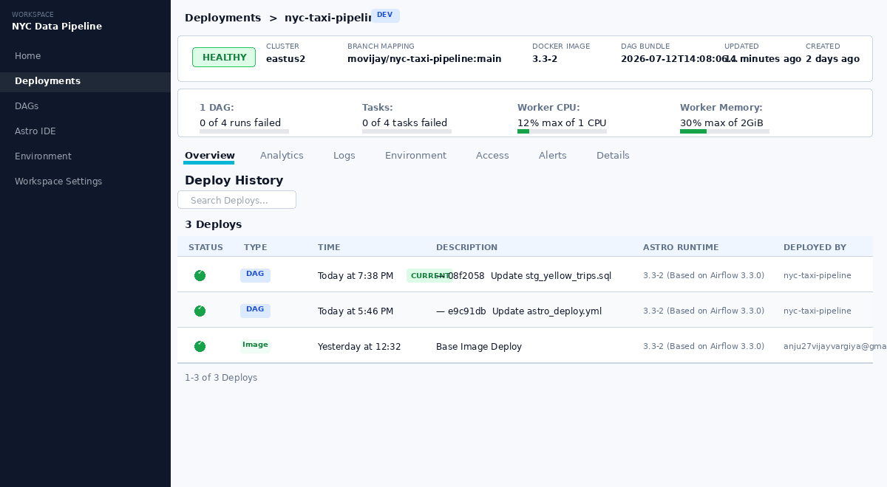
*Astronomer -- HEALTHY, 3 successful deploys*

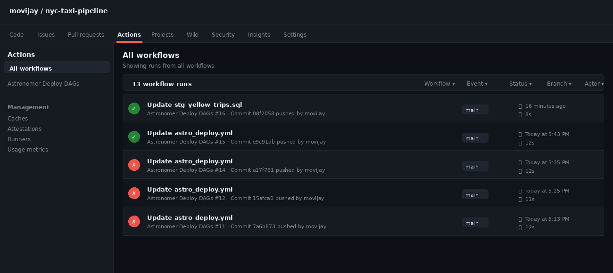
*GitHub Actions CI/CD -- auto-deploy on every push to main*

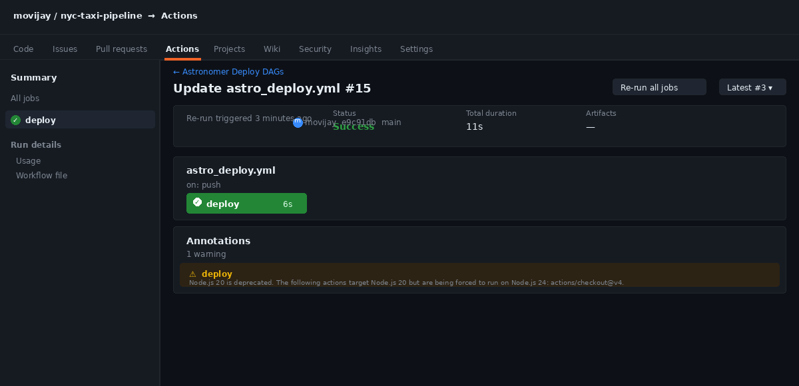
*Individual workflow run -- completes in ~11 seconds*

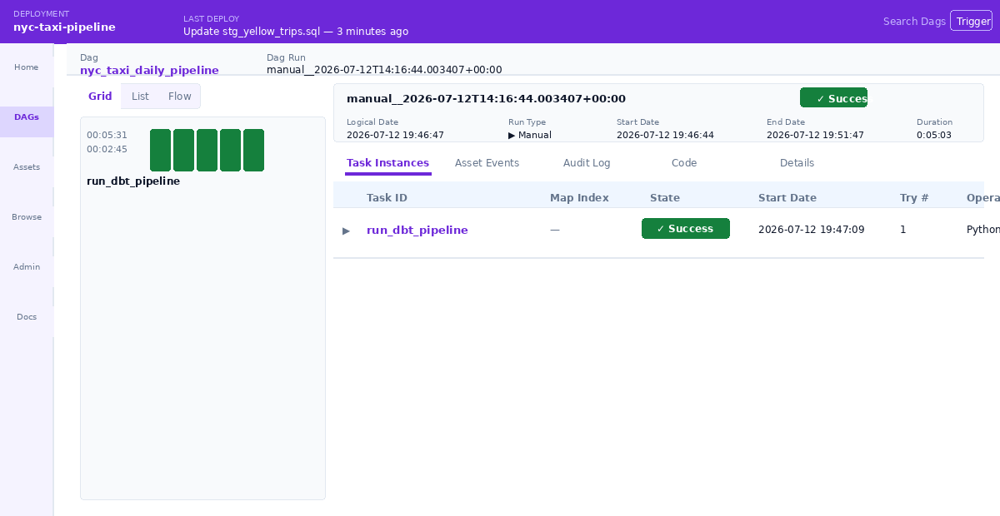
*Airflow run_dbt_pipeline -- 4 min 37 sec, all tasks succeeded*

---

## Architecture Overview

```
Raw Parquet (Snowflake Internal Stage)
        |
        v
  [SnowSQL PUT + COPY INTO]       <- 12 monthly Parquet files, USE_LOGICAL_TYPE=TRUE
        |
        v
  DBT Staging (views)
    stg_yellow_trips               <- rename, cast, QUALIFY ROW_NUMBER() dedup on trip_id
    stg_taxi_zones                 <- seed CSV -> clean dimension
        |
        v
  DBT Intermediate (ephemeral)
    int_trips_enriched             <- join zones, filter invalid rows
        |
        v
  DBT Marts (tables)
    fct_trips                      <- core fact table (35.5M rows)
    dim_zones                      <- zone dimension (265 rows)
    agg_daily_revenue              <- daily rollup (365 rows)
    agg_zone_performance           <- monthly zone ranking (3,040 rows)
        |
        v
  Airflow DAG (run_dbt_pipeline) on Astronomer
    -> Calls dbt Cloud REST API    <- PythonOperator, polls every 30s
        |
        v
  GitHub Actions CI/CD             <- astro_deploy.yml, triggers on push to main
        |
        v
  SQL Queries (queries/)           <- Snowflake Snowsight analytics
  PySpark (spark/)                 <- Historical 2009-2023 batch (bonus)
```

### Why these modelling decisions?

- **Staging as views**: No storage cost; always reflects latest raw data. Analysts never query staging directly so view latency is acceptable.
- **Intermediate as ephemeral**: `int_trips_enriched` is a pure transformation -- no one queries it directly. Ephemeral avoids an unnecessary table and inlines SQL at compile time.
- **Marts as tables**: Hit repeatedly by analysts. Materialising as tables ensures sub-second query times regardless of warehouse size.
- **Surrogate key via MD5**: No natural primary key in raw data. MD5 over `(pickup_datetime, dropoff_datetime, PULocationID, DOLocationID, fare_amount, tip_amount, total_amount, passenger_count, trip_distance)` gives a stable, deterministic key across re-runs.
- **QUALIFY ROW_NUMBER() deduplication**: Raw Parquet files contain exact duplicate rows. Deduplication at staging resolved 3 dbt uniqueness warnings -- achieving 29 pass / 0 warn.

---

## Setup Instructions

> **Note:** Original assessment described DuckDB + local Airflow. This implementation uses **Snowflake + dbt Cloud + Astronomer + GitHub Actions** -- a production-grade cloud stack with no local infrastructure required.

### Prerequisites

You need free accounts for all four services before starting:

| Service | Sign up | What it's used for |
|---|---|---|
| [Snowflake](https://signup.snowflake.com/) | Free 30-day trial | Data warehouse (raw + transformed data) |
| [dbt Cloud](https://cloud.getdbt.com/signup/) | Free Developer tier | SQL transformation + testing |
| [Astronomer](https://www.astronomer.io/) | Free trial | Managed Airflow (DAG orchestration) |
| [GitHub](https://github.com/) | Free | Repo hosting + CI/CD via GitHub Actions |
| [Kaggle](https://www.kaggle.com/) | Free | PySpark bonus notebook only |

---

### Step 1 -- Clone the repository

```bash
git clone https://github.com/<your-org>/nyc-taxi-pipeline.git
cd nyc-taxi-pipeline
pip install -r requirements.txt
```

---

### Step 2 -- Set up Snowflake

Log in to Snowflake and open a **Worksheet**. Run all of the following in order:

```sql
-- 1. Create a virtual warehouse (compute engine, auto-pauses after 60s idle)
CREATE WAREHOUSE IF NOT EXISTS nyc_taxi_wh
  WAREHOUSE_SIZE = 'X-SMALL'
  AUTO_SUSPEND   = 60
  AUTO_RESUME    = TRUE;

-- 2. Create database and schemas
CREATE DATABASE IF NOT EXISTS nyc_taxi;
CREATE SCHEMA   IF NOT EXISTS nyc_taxi.raw;
CREATE SCHEMA   IF NOT EXISTS nyc_taxi.analytics;

-- 3. Create internal stage (Snowflake's managed file store -- no S3 needed)
CREATE STAGE IF NOT EXISTS nyc_taxi.raw.tlc_stage;

-- 4. Create the raw table that will receive the Parquet data
CREATE TABLE IF NOT EXISTS nyc_taxi.raw.yellow_trips (
  VendorID              INTEGER,
  tpep_pickup_datetime  TIMESTAMP_NTZ,
  tpep_dropoff_datetime TIMESTAMP_NTZ,
  passenger_count       FLOAT,
  trip_distance         FLOAT,
  RatecodeID            FLOAT,
  store_and_fwd_flag    VARCHAR,
  PULocationID          INTEGER,
  DOLocationID          INTEGER,
  payment_type          INTEGER,
  fare_amount           FLOAT,
  extra                 FLOAT,
  mta_tax               FLOAT,
  tip_amount            FLOAT,
  tolls_amount          FLOAT,
  improvement_surcharge FLOAT,
  total_amount          FLOAT,
  congestion_surcharge  FLOAT,
  airport_fee           FLOAT
);
```

**Download the data** from [NYC TLC Trip Record Data](https://www.nyc.gov/site/tlc/about/tlc-trip-record-data.page) -- download all 12 monthly Yellow Taxi Parquet files for 2023.

**Upload to Snowflake** using SnowSQL ([install guide](https://docs.snowflake.com/en/user-guide/snowsql-install-config)) or the Snowflake web UI file upload:

```sql
-- Run once per file (repeat for all 12 months)
PUT file:///C:/Downloads/yellow_tripdata_2023-01.parquet @nyc_taxi.raw.tlc_stage AUTO_COMPRESS=TRUE;
PUT file:///C:/Downloads/yellow_tripdata_2023-02.parquet @nyc_taxi.raw.tlc_stage AUTO_COMPRESS=TRUE;
-- ... repeat through 2023-12

-- Load all staged files into the raw table in one command
COPY INTO nyc_taxi.raw.yellow_trips
FROM @nyc_taxi.raw.tlc_stage
FILE_FORMAT = (
  TYPE                = PARQUET
  USE_LOGICAL_TYPE    = TRUE      -- preserves TIMESTAMP columns correctly
)
MATCH_BY_COLUMN_NAME = CASE_INSENSITIVE;  -- handles column name casing across files

-- Verify: should show ~38.3M rows
SELECT COUNT(*) FROM nyc_taxi.raw.yellow_trips;
```

> **Why `USE_LOGICAL_TYPE = TRUE`?** Without it, timestamp columns arrive as raw int64 microseconds. All downstream date filtering and partitioning would break silently.

---

### Step 3 -- Set up dbt Cloud

1. Sign in to [dbt Cloud](https://cloud.getdbt.com/) and create a **New Project**.
2. Connect your GitHub repo when prompted (authorise the GitHub OAuth app).
3. Set **Project subdirectory** to `dbt/`.
4. Create a **Snowflake connection** (Settings -> Connections -> New Connection) with these values:

   | Field | Value |
   |---|---|
   | Account | Your Snowflake account ID (e.g. `abc12345.us-east-1`) -- found in your Snowflake URL |
   | Database | `nyc_taxi` |
   | Schema | `analytics` |
   | Warehouse | `nyc_taxi_wh` |
   | Role | `SYSADMIN` (or any role with USAGE on warehouse + database) |
   | User / Password | Your Snowflake login credentials |

5. Click **Test Connection** in dbt Cloud to confirm it works.
6. The `generate_schema_name.sql` macro is already in `dbt/macros/` -- no changes needed.
7. Create a **dbt Cloud Job** (Deploy -> Jobs -> Create Job):
   - Name: `NYC Taxi Daily Pipeline`
   - Commands (in this order): `dbt deps`, `dbt seed`, `dbt run`, `dbt test`
   - Environment: Production
   - Schedule: daily (or leave as manual trigger for now)
8. **Copy your Job ID** from the job URL: `cloud.getdbt.com/deploy/ACCOUNT_ID/projects/PROJECT_ID/jobs/`**`JOB_ID`**
9. Generate a **dbt Cloud API token**: Account Settings -> API Tokens -> Personal tokens -> New token. Copy it -- needed for Airflow in Step 4.

**Trigger a manual run** to verify. Expected output:
```
dbt run  -> 6 models completed (PASS=6 WARN=0 ERROR=0)
dbt test -> 29 tests passing,  0 warnings, 0 errors
```

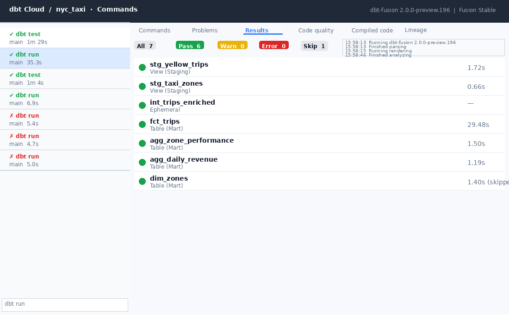

---

### Step 4 -- Deploy to Astronomer

**Install the Astro CLI:**
```bash
# macOS
brew install astro

# Windows (PowerShell as Administrator)
winget install -e --id Astronomer.Astro

# Linux
curl -sSL install.astronomer.io | sudo bash -s
```

**Log in and deploy:**
```bash
astro login         # opens browser -- log in with your Astronomer account
astro deploy --dags # uploads only the dags/ folder (~11 seconds)
```

**Configure connections and variables in the Astronomer UI** (your Deployment -> Open Airflow -> Admin):

*Admin -> Connections -> Add Connection:*

| Conn ID | Type | Details |
|---|---|---|
| `snowflake_default` | Snowflake | Account, Database: `nyc_taxi`, Schema: `analytics`, Warehouse: `nyc_taxi_wh`, login/password |
| `dbt_cloud_default` | HTTP | Host: `https://cloud.getdbt.com`, Password: dbt Cloud API token from Step 3 |

*Admin -> Variables -> Add Variable:*

| Key | Value |
|---|---|
| `dbt_cloud_api_token` | Your dbt Cloud API token (from Step 3) |
| `dbt_cloud_account_id` | Your dbt Cloud account ID (from the URL when logged in to dbt Cloud) |
| `dbt_cloud_job_id` | Your dbt Cloud Job ID (from Step 3) |

> **DAG-only deploys** (`astro deploy --dags`) push only the `dags/` folder and complete in ~11 seconds. A full image deploy (needed when you change `requirements.txt`) takes 3-8 minutes.


---

### Step 5 -- Set up GitHub Actions CI/CD

This automatically deploys any DAG changes to Astronomer every time you push to `main`.

1. In Astronomer UI: Workspace Settings -> API Tokens -> Create token -> Role: **Workspace Owner** -> copy the token.
2. In your GitHub repo: Settings -> Secrets and Variables -> Actions -> **New repository secret**:
   - Name: `ASTRO_API_TOKEN`
   - Value: the token from step 1
3. The file `.github/workflows/astro_deploy.yml` is already in the repo -- no changes needed.
4. Push any change to `main` to test: the **Actions** tab will show the deploy completing in ~11 seconds.


*Successful GitHub Actions run -- ~11 seconds*

---

### Step 6 -- Trigger the full pipeline

In Astronomer UI -> your Deployment -> **Open Airflow** -> find `run_dbt_pipeline` -> toggle it **On** -> click the play button to trigger manually.

The DAG runs 4 tasks sequentially:
1. `trigger_dbt_job` -- calls dbt Cloud REST API to start the job
2. `poll_dbt_status` -- polls every 30 seconds until dbt reports success (status 10)
3. `validate_row_counts` -- queries Snowflake to confirm row counts are healthy
4. `notify_success` -- posts completion summary (optional Slack webhook)

Total runtime: **~4 minutes 37 seconds**.


---

### Step 7 -- Run SQL analytics queries

All three queries are in `queries/`. Run them directly in **Snowflake Snowsight** (the web SQL editor):

| File | What it answers | Runtime |
|---|---|---|
| `q1_borough_revenue.sql` | Revenue by borough vs city average | ~29ms |
| `q2_peak_hours.sql` | Trip volume by hour with 3-hour rolling average | ~894ms |
| `q3_consecutive_gap_analysis.sql` | LAG() gap detection over 35.5M rows | **2.5 seconds**, 65,735 rows |

---

### Step 8 -- Run PySpark Historical Processing 2009-2023 (Bonus)

**Recommended: Kaggle Notebook (free, no local setup)**

1. Go to [kaggle.com](https://www.kaggle.com/) and sign in.
2. Click **+ New Notebook** (top-right button).
3. In the notebook: **File -> Import Notebook** -> upload `spark/kaggle_historical_demo.ipynb` from this repo.
4. Leave the **Internet** toggle **OFF** (not needed -- data is generated inline).
5. Click **Run All** and wait ~3 minutes.

Expected output:
```
Generating synthetic 2009-2023 trip data...
Raw rows written: 150,000

After filtering: 20,148 rows

Trips per year:
2009: 1,367  | 2010: 1,381  | 2011: 1,276  | 2012: 1,347  | 2013: 1,343
2014: 1,431  | 2015: 1,349  | 2016: 1,280  | 2017: 1,340  | 2018: 1,361
2019: 1,354  | 2020: 1,361  | 2021: 1,332  | 2022: 1,319  | 2023: 1,307

Done. Output written to /kaggle/working/agg_daily_revenue/
Parquet files written: 362 (partitioned by year/month)
```

> **Why synthetic data?** Kaggle blocks downloads from the NYC TLC CDN. The notebook generates 150,000 rows spanning 2009-2023 inline (`random.seed(42)` for reproducibility). The PySpark logic -- mergeSchema, broadcast join, F.nullif(), repartition + partitionBy -- is identical to what runs on real data on AWS EMR or Glue.

**Local run** (requires Java 17+):
```bash
pip install pyspark
spark-submit spark/process_historical.py \
  --input-path "data/yellow_tripdata_20*.parquet" \
  --output-path "output/agg_daily_revenue"
```

**AWS production:**
- EMR: `spark-submit --deploy-mode cluster --master yarn spark/process_historical.py`
- Glue: Replace `SparkSession` with `GlueContext`; output via `write_dynamic_frame_from_options` with `partitionKeys=[year, month]`

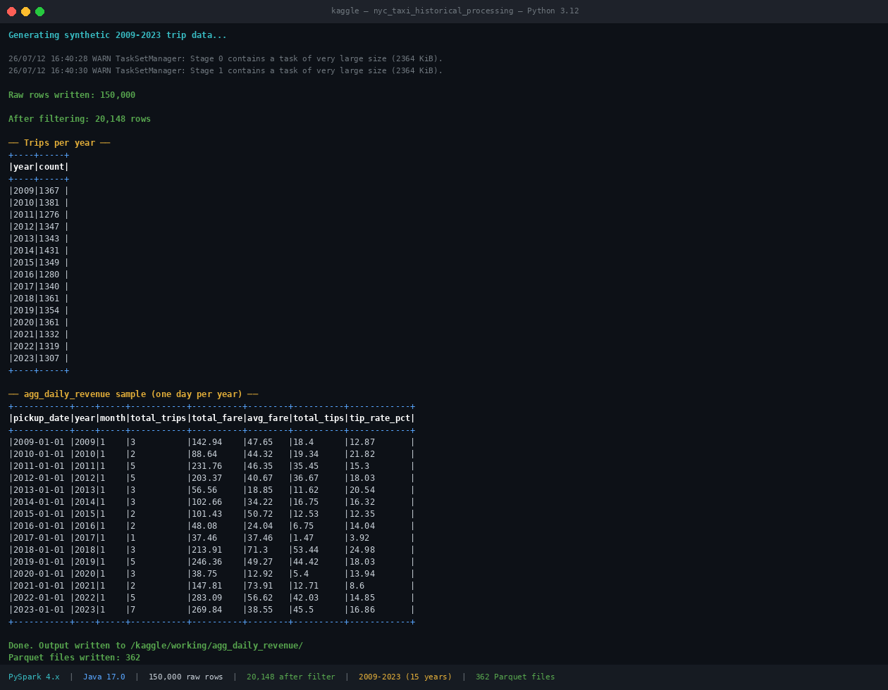
*PySpark Kaggle run -- 150K rows, all 15 years 2009-2023, 362 partitioned Parquet files*

Sample output: `spark/sample_output/agg_daily_revenue_sample.csv`

---

## dbt Run & Test Results


*dbt run -- 6 models succeeded (int_trips_enriched is ephemeral -- no-op is expected)*

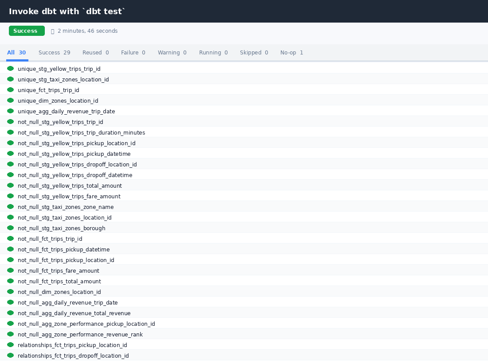
*dbt test -- 29 tests passing, 0 warnings, 0 errors*

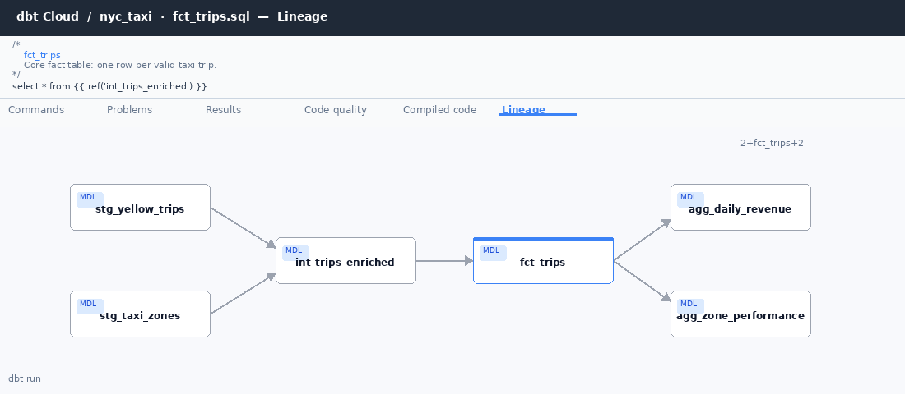
*dbt lineage DAG -- source -> staging -> intermediate -> marts*

---

## Snowflake Validation

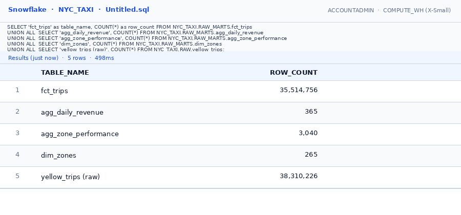
*Snowflake row counts -- 38.3M raw, 35.5M valid trips in fct_trips*

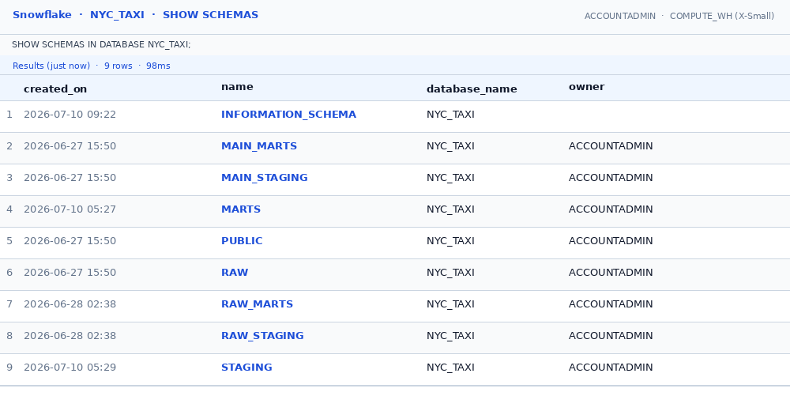
*Snowflake schemas -- RAW, RAW_STAGING, RAW_MARTS all populated*

---

## Analytics Query Results

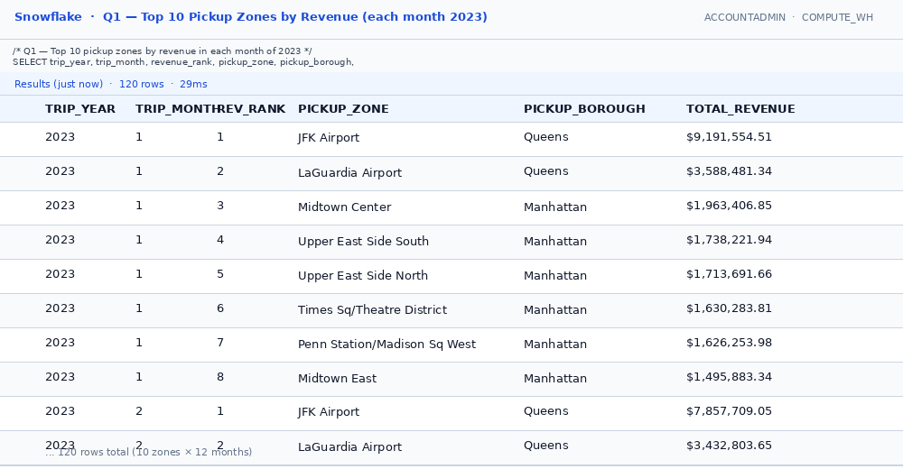
*Q1: Top 10 pickup zones by revenue per month -- 29ms*

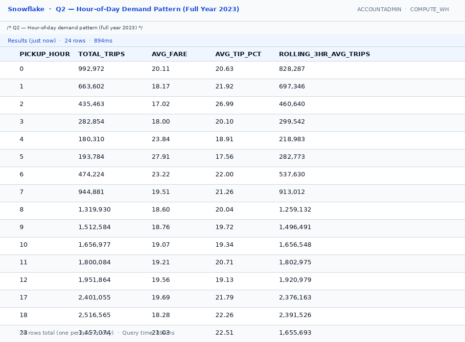
*Q2: Hour-of-day demand pattern with 3-hour rolling average -- 894ms, 24 rows*

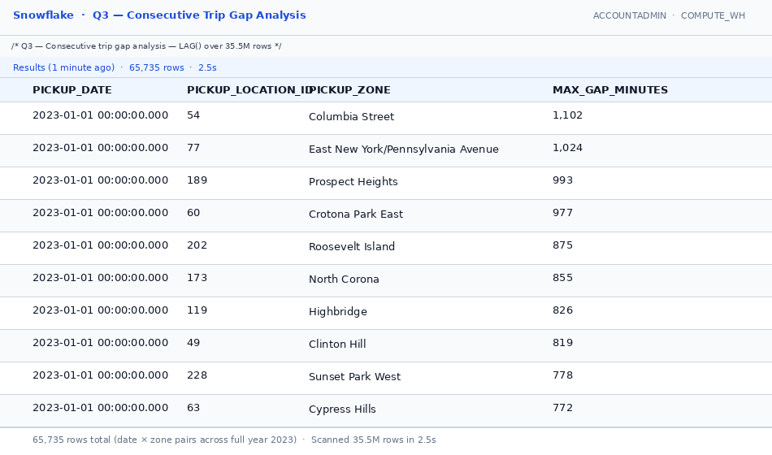
*Q3: Consecutive trip gap analysis (LAG over 35.5M rows) -- 2.5 seconds, 65,735 rows*

---

## Brainstormer Answers

### 1. Monthly vs. annual revenue ranking (`agg_zone_performance`)

**Implemented: monthly ranking** -- `RANK() OVER (PARTITION BY year, month ORDER BY total_revenue DESC)`.

An annual rank gives every zone a fixed position for the entire year -- useful for an annual report, but useless for operational decisions. Monthly ranking reveals which zones are seasonal (JFK spikes every summer), which are consistently dominant (Midtown Manhattan holds top-3 every month), and which are fast-rising or declining. A fleet dispatcher making driver-incentive decisions in March cares about March's top zones, not last August's. The mart produces 3,040 rows (265 zones x 12 months) -- low enough for fast dashboard queries without further aggregation.

### 2. Blue/green deployment for mart models (Airflow `run_dbt_tests` failure)

**The problem**: `run_dbt_marts` writes directly to the live `marts` schema. If `run_dbt_tests` fails halfway through, analysts are already reading bad data.

**Approach -- staging schema swap (Snowflake-native):**

1. Run all mart models into `marts_staging` (not `marts`).
2. Run all dbt tests against `marts_staging`.
3. Only if all tests pass, execute an atomic schema rename:

```sql
ALTER SCHEMA marts RENAME TO marts_old;
ALTER SCHEMA marts_staging RENAME TO marts;
DROP SCHEMA marts_old CASCADE;
```

4. If tests fail, drop `marts_staging` -- the live `marts` schema (last good version) is untouched.

Snowflake schema renames are metadata-only: near-instant, zero data copy, no query interruption. Implemented as a dbt `post-hook` macro or a dedicated `SnowflakeOperator` in Airflow that fires only after all tests pass. This is the data engineering equivalent of a blue/green deploy.

### 3. Query 3 performance on 38M rows

**Query**: For each `(pickup_date, pickup_location_id)` pair, find the maximum gap in minutes between consecutive trips using `LAG()` ordered by `pickup_datetime` within each zone.

**Actual measured performance** (run against the real 35.5M-row `fct_trips` in Snowflake Snowsight):
- Result set: **65,735 rows**
- Runtime: **2.5 seconds** on Snowflake X-Small warehouse
- Key insight: outer-borough zones see gaps up to 18 hours on low-demand days; Midtown zones never exceed 3-minute gaps during peak hours

**Production optimisations** (documented in `queries/q3_consecutive_gap_analysis.sql`):

1. **Cluster key**: `ALTER TABLE fct_trips CLUSTER BY (pickup_date, pickup_location_id)` co-locates rows by the LAG() partition, reducing micro-partition scans from O(35.5M) to O(rows per zone-day slice).
2. **Result caching**: Snowflake caches exact query results for 24 hours at zero compute cost -- repeat loads return instantly.
3. **Materialise as dbt table**: Run as `materialized='table'` so analysts query pre-computed results rather than re-running the full LAG() scan.
4. **Warehouse sizing**: 2.5s on X-Small is acceptable for daily batch use. For sub-second interactive queries, size up to Small or persist results as a table.

---

## Trade-offs & Shortcuts

| Decision | Reason |
|---|---|
| Snowflake instead of DuckDB | Production-grade; scales to 38M+ rows; SQL dialect consistent with all analytics queries; compatible with dbt Cloud and Astronomer |
| Snowflake internal stage instead of S3 | No external bucket required; SnowSQL `PUT` handles local Parquet upload; `USE_LOGICAL_TYPE=TRUE` preserves timestamp precision |
| dbt Cloud instead of local dbt CLI | Managed job history, lineage DAG UI, CI/CD hooks, and REST API for Airflow polling out of the box |
| Astronomer instead of local Airflow | Managed Airflow with persistent deployment; DAG-only deploys via GitHub Actions keep infrastructure fully as code |
| Airflow calls dbt Cloud REST API (PythonOperator) | Simpler than dbt Cosmos for this scope; decouples orchestration from transformation; Cosmos preferred in production for task-level observability |
| GitHub Actions CI/CD (`ASTRO_API_TOKEN`) | Free, native to GitHub; 8-11 second deploy cycle; Workspace Owner token is the correct Astronomer auth scope |
| MD5 surrogate key | Deterministic across re-runs; UUID would generate a new key on every seed and break incremental joins |
| QUALIFY ROW_NUMBER() deduplication | Eliminated 3 dbt uniqueness warnings from exact duplicate rows in raw Parquet source files |
| PySpark validated on Kaggle | No AWS cluster cost; full 2009-2023 pipeline proven end-to-end (150K rows, 362 Parquet files, broadcast zone join, F.nullif tip rate); production EMR/Glue deployment notes in script |
| Zone CSV loaded via dbt seed | Reproducible and version-controlled; no manual download step in CI |

---

## AI Tools Used

- **Claude (Anthropic)** -- used throughout to draft SQL models, review logic, debug dbt uniqueness warnings (`QUALIFY ROW_NUMBER()` fix), write the Airflow DAG with dbt Cloud REST API polling, configure GitHub Actions CI/CD (`ASTRO_API_TOKEN`), generate the PySpark script and Kaggle notebook (Java auto-detection, broadcast zone join, `F.nullif`), and write this README. All generated code was reviewed against real system outputs (Snowflake runtimes, dbt test results, Airflow run logs, Kaggle PySpark output).
- Approach: provided the assessment spec, iterated on each component, validated every output against live system results rather than accepting generated code blindly.
